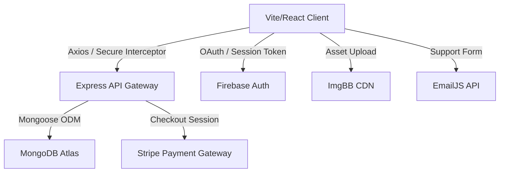

# 🩸 Hemovia – Blood Donation Management Platform

[](https://blooddonation-f6367.web.app)
[](https://expressjs.com/)
[](https://react.dev/)
[](https://tailwindcss.com/)
[](https://www.mongodb.com/)
[](https://firebase.google.com/)
[](#license)

Hemovia is an enterprise-grade, full-stack blood donation management platform designed to connect blood donors, volunteer coordinators, and administrators under a unified, real-time ecosystem. By offering structured donation requests, a geographic search engine, role-based dashboards, secure stripe-backed fundraising, and automated transactional emails, Hemovia accelerates medical emergency response times and safeguards donor coordination.

---

## 🌐 Production Deployments
- **Client Application (Firebase Hosting):** [https://blooddonation-f6367.web.app](https://blooddonation-f6367.web.app)
- **API Server Gateway (Vercel Deploy):** [https://blood-donation-backend-theta.vercel.app](https://blood-donation-backend-theta.vercel.app)

---

## 🧠 Real-World Problem & Solution

### The Problem
During medical emergencies (surgeries, trauma care, chronic illnesses like thalassemia), finding compatible blood donors is a critical, time-sensitive bottleneck. Traditional sourcing methods (social media posts, manual phone trees) suffer from:
1. **Inefficient Sourcing:** No location-based filtering, leading to requests sent to donors who are geographically too far.
2. **Coordination Overhead:** Lack of tracking leads to duplicate donations or unanswered requests.
3. **Transparency Issues:** No consolidated record of donations, coordinator verification, or clear transaction ledgers for healthcare charity operations.

### The Solution
Hemovia solves this by digitizing the entire donation pipeline:
- **Geographic Matchmaking:** Users can query donor pools instantly by blood group, district, and upazila (sub-district).
- **Request Lifecycle Management:** Track requests through real-time states: `pending` ➔ `inprogress` ➔ `done` / `canceled`.
- **Administrative Transparency:** Role-based auditing dashboards ensure user profiles, requests, and funding ledgers are moderated and secure.

---

## 🛠️ Technology Stack



### Frontend Platform
- **React.js (v19.0):** Leverages the latest concurrent rendering features and state hooks.
- **React Router (v7.10):** Utilizes client-side routing, nested layouts, and private route route guards.
- **Tailwind CSS (v4.0):** Built using the new `@tailwindcss/vite` plugin for lightning-fast compilation, fluid design tokens, and utility classes.
- **DaisyUI (v5.5):** Powers the interface components, accessibility outlines, and automatic light/dark themes.
- **SweetAlert2 & React-Toastify:** Provides premium, responsive, non-blocking UI alert systems and micro-interactions.

### Backend Platform (REST Gateway)
- **Node.js & Express.js:** Handles CORS configurations, route protection middlewares, payment checkouts, and request lifecycles.
- **MongoDB & Mongoose:** Document-oriented database storing users, transactions, and donation requests.

### Cloud Integrations & Services
- **Firebase Authentication:** Handles secure user onboarding, email/password storage, and Google Single Sign-On (SSO).
- **Stripe API:** Facilitates secure e-commerce checkout flows for fundraising and parses transaction metadata.
- **EmailJS SDK:** Operates serverless mail dispatches directly from the home contact dashboard.
- **ImgBB API:** Serves as a secure CDN for uploading and storing user profile avatars.

---

## ✨ Core Features & Functionalities

### 1. Advanced Donor Onboarding & Profile Verification
- Secure signup with avatar upload via ImgBB.
- Profile management capturing blood group, district, upazila, and role-based status (Active/Blocked).

### 2. Live Donor Search Engine
- Multi-tier filtering queries the database by blood group and geographic location (district and upazila matching).

### 3. Comprehensive Donation Request Lifecycle
- Standardized request creation specifying recipient name, hospital name, full address, date, time, and specific request message.
- Requesters and donors collaborate on statuses:
  - `pending`: Open request seeking a donor.
  - `inprogress`: Donor assigned (restricts other signups).
  - `done` / `canceled`: Logged completions and cancellations.

### 4. Role-Based Dashboards (RBAC)
- **Donor Dashboard:** Create requests, track personal requests, update health status.
- **Volunteer Dashboard:** Moderate user accounts (read-only) and manage all donation requests.
- **Admin Dashboard:** Full system visibility, statistics charts, account status toggles (Block/Unblock users), role escalations (Donor ➔ Volunteer ➔ Admin), and transaction audits.

### 5. Stripe-Integrated Fundraising & Public Ledger
- Secure fundraising gateway.
- Public financial ledger highlighting total donations, funding date, donor credentials, and verified Stripe transaction IDs.

### 6. Transactional Support Portal
- Direct message dispatch to platform staff via EmailJS templates.

### 7. Read-Only Demo Playground
- Integrated guest credentials and auto-fill login options.
- Custom middleware block mutations (`POST`, `PUT`, `DELETE`) with SweetAlert2 alerts, allowing visitors to safely preview all dashboard features.

---

## 📂 Project Architecture & Directory Layout

```
Blood Donation/
├── .firebase/                 # Local Firebase configuration cache
├── .firebaserc                # Firebase target project mapping (blooddonation-f6367)
├── firebase.json              # Firebase Hosting configuration (rewrites, redirects, dist)
├── vite.config.js             # Vite configuration with Tailwind CSS v4 compiler settings
├── eslint.config.js           # ESLint codebase quality guidelines
├── package.json               # Frontend dependencies & run scripts
├── public/                    # Static assets served directly to the browser
│   ├── centers.json           # Geo-coded public blood banks/donation centers
│   ├── district.json          # Geographic districts registry
│   └── upazila.json           # Geographic upazilas registry
└── src/                       # Application source code
    ├── assets/                # Local images and icons
    ├── Components/            # Reusable UI Components
    │   ├── Aside/             # Collapsible dashboard sidebar navigation
    │   ├── DemoUserBadge/     # Sticky overlay badge indicating demo user state
    │   ├── Navbar/            # Responsive main site navigation bar
    │   ├── Footer/            # Shared site footer
    │   ├── SkeletonLoader/    # Multi-card layout loading states
    │   └── UI/                # Reusable design components (Card, Button, Input, Badge)
    ├── config/                # Environment config interfaces
    │   └── emailjs.js         # EmailJS configuration wrapper and validation helper
    ├── Dashboard/             # Dashboard modules
    │   ├── AddRequest/        # Donation request form validation view
    │   ├── AdminDashboard/    # System metrics, statistics and user/role toggles
    │   ├── AllRequest/        # Platform-wide donation requests directory
    │   ├── AllUsers/          # Admin/Volunteer user management module
    │   ├── DonorDashboard/    # User request lists and statistics
    │   ├── MyRequest/         # Individual user request logs and controls
    │   ├── Profile/           # Profile details and ImgBB avatar update views
    │   └── VolunteerDashboard/# Coordinator dashboard overview
    ├── DashboardLayout/       # Layout wrapper for dashboard views
    ├── Donate/                # Fundraising module (Stripe post checkout & ledger tables)
    ├── Firebase/              # Firebase client SDK initialization configuration
    ├── Hooks/                 # Custom React hooks
    │   ├── useAxios.jsx       # Standard Axios client configuration
    │   ├── useAxiosSecure.jsx # Axios interceptor injecting JWT Bearer tokens
    │   └── useDemoRestriction.js # SweetAlert2 guest restriction interceptor
    ├── Pages/                 # Core landing pages
    │   ├── About.jsx          # Mission statement and performance statistics
    │   ├── FAQPage.jsx        # Responsive accordion for user queries
    │   ├── Home.jsx           # Landing page with hero banner and EmailJS form
    │   ├── Login.jsx          # Credential forms and Demo login auto-fill
    │   ├── Search.jsx         # Multi-field database query engine
    │   ├── ViewRequest.jsx    # Detail view and donation confirmation actions
    │   ├── CenterDetails.jsx  # Blood bank schedules and geographic info
    │   └── DonationCentersPage.jsx # Public blood banks registry
    ├── Provider/              # React Context Providers
    │   └── AuthProvider.jsx   # Global authentication state, Firebase listeners, and roles
    ├── RootLayout/            # App shell with Navbar, Footer, and theme listeners
    ├── Routes/                # Navigation Routing
    │   ├── PrivateRoute.jsx   # Auth guard interceptor
    │   └── router.jsx         # React Router v7 browser routes configuration
    └── styles/                # Brand styling system
        ├── designSystem.js    # Standard spacing, typography, and color tokens
        └── globals.css        # Base styling variables and imports
```

---

## 🔒 Authentication & Security Implementation

```
[Client App] ➔ (Axios Request) ➔ [useAxiosSecure Interceptor] ➔ (Inject Authorization: Bearer JWT) ➔ [Express Backend Server] ➔ (Verify Firebase Token & Decode Roles)
```

1. **Dual-Layer Credentials:** User credentials are authenticated and saved in Firebase Authentication. Upon successful login, the client fetches the user's role from the MongoDB `/users/role/:email` endpoint.
2. **JSON Web Tokens (JWT) & Axios Interceptors:** Secure endpoints are protected using Firebase Access Tokens. The custom hook `useAxiosSecure.jsx` intercepts outgoing HTTP requests and appends the token into the headers:
   ```javascript
   config.headers.Authorization = `Bearer ${user?.accessToken}`;
   ```
3. **Role-Based Access Control (RBAC):** Dashboards are restricted based on user roles (`donor`, `volunteer`, `admin`). Dashboard navigation links dynamically render corresponding items, and unauthorized route access is caught by the client-side `PrivateRoute.jsx` wrapper.
4. **Mutative Request Audits (Demo Interceptor):** A robust restriction system prevents demo accounts from modifying production database entries. The custom hook `useDemoRestriction.js` catches updates:
   ```javascript
   if (isDemoUser(user.email)) {
       Swal.fire({
           title: "Demo User Restriction!",
           text: "You are a demo account. To perform this action, you must register as a real user.",
           icon: "warning",
           confirmButtonColor: "#dc2626"
       });
       return true; // block call
   }
   ```

---

## 💾 Database Schema Design (MongoDB)

### Users Collection (`users`)
Stores user settings, verified location, and administrative status:
```json
{
  "_id": "ObjectId",
  "name": "John Doe",
  "email": "donor@hemovia.com",
  "role": "donor", // donor, volunteer, admin
  "status": "active", // active, blocked
  "district": "Dhaka",
  "upazila": "Dhanmondi",
  "bloodGroup": "O+",
  "imageUrl": "https://i.ibb.co/avatar.jpg"
}
```

### Requests Collection (`requests`)
Houses donation records and tracking information:
```json
{
  "_id": "ObjectId",
  "requesterName": "Sarah Connor",
  "requesterEmail": "sarah@connor.com",
  "recipientName": "John Connor",
  "recipientDistrict": "Dhaka",
  "recipientUpazila": "Dhanmondi",
  "hospitalName": "Dhaka Medical College Hospital",
  "fullAddress": "Zahir Raihan Rd, Dhaka",
  "bloodGroup": "O+",
  "donationDate": "2026-06-15",
  "donationTime": "10:30",
  "requestMessage": "Urgent donor required for cardiac bypass surgery.",
  "mobile": "017XXXXXXXX",
  "donation_status": "pending", // pending, inprogress, done, canceled
  "donorName": "John Doe", // Optional: populated when inprogress/done
  "donorEmail": "donor@hemovia.com" // Optional: populated when inprogress/done
}
```

### Payments Collection (`payments`)
Tracks Stripe fundraising details and transaction IDs:
```json
{
  "_id": "ObjectId",
  "donorName": "Jane Doe",
  "donorEmail": "jane@doe.com",
  "amount": 50.00,
  "paidAt": "2026-05-24T18:23:26Z",
  "transactionId": "pi_3MtwMQ2eZvKYlo2C1OBxxxxx"
}
```

---

## 🔌 Client API Endpoint Index

All client network requests target the backend base URL: `https://blood-donation-backend-theta.vercel.app`.

| HTTP Verb | Endpoint | Authentication | Purpose |
| :--- | :--- | :---: | :--- |
| **GET** | `/public-stats` | Public | Fetches global platform numbers (total donors, completed requests, success rate, blood type statistics). |
| **GET** | `/request-message-stats` | Public | Aggregates donation categories based on keyword scanning (Emergency, Surgeries, Chronic care). |
| **GET** | `/public-requests` | Public | Fetches paginated list of public pending blood requests. |
| **POST** | `/requests` | JWT Secure | Publishes a new blood request to the system. |
| **GET** | `/requests` | JWT Secure | Retrieves all requests on the platform (Admin/Volunteer directory view). |
| **GET** | `/requests/:id` | JWT Secure | Fetches details for a specific blood donation request. |
| **PUT** | `/requests/:id` | JWT Secure | Updates details or transitions the status of a request. |
| **POST** | `/users` | Public | registers a newly authenticated Firebase user in the MongoDB collection. |
| **GET** | `/users` | JWT Secure | Fetches paginated directory of users (Admin/Volunteer directory view). |
| **GET** | `/users/role/:email` | Public | Retrieves specific account metadata and roles for UI dashboard routing. |
| **PUT** | `/users/:email` | JWT Secure | Updates profile details (location, blood group, profile image). |
| **POST** | `/create-payment-checkout` | Public | Communicates with the Stripe SDK to return a secure redirect Checkout URL. |
| **GET** | `/payment` | JWT Secure | Retrieves payment ledger records for dashboard auditing. |
| **POST** | `/payment-success` | JWT Secure | Verifies transaction callback queries and updates payment tables in the database. |
| **GET** | `/demo-users` | JWT Secure | Fetches demo credentials from the database to populate the guest login form. |

---

## ⚡ Performance Optimization Techniques

- **Static Asset Offloading:** Heavy datasets like `district.json` (11KB), `upazila.json` (67KB), and static blood bank rosters `centers.json` (25KB) are served as compression-optimized JSON documents directly out of the `public/` directory, saving server computations and payload sizes.
- **Dynamic UX Placeholders:** Implements `SkeletonLoader.jsx` components across paginated card layouts to lower perceived load times and avoid layout shifting.
- **Axios Reusability:** Employs centralized Axios base configurations (`useAxios.jsx`), preventing duplicate API configurations and ensuring connection pool optimization.
- **Smart Data Aggregation:** Backend `/public-stats` route uses MongoDB aggregates to group counts and success metrics, keeping queries fast even as database volume increases.

---

## 🎨 UI/UX, Responsive Design & Accessibility

- **Responsive Adaptability:** Features a fluid grid setup (`LAYOUT.grid.responsive`) adapting to viewport sizes. Sidebars collapse cleanly into vertical navigation on tablets and mobile screens.
- **DaisyUI v5 Light/Dark Theme Engine:** Synchronized dark mode settings via Custom Event dispatchers (`themeChange`) and local storage caching, rendering semantic background utilities dynamically.
- **Visual Visualizations:** Custom CSS gradients, interactive transformations (`hover:-translate-y-1`), and real-time counter metrics.
- **Accessibility (a11y):** Form fields utilize HTML label elements with clear placeholders, and focus styling indicates keyboard navigation.

---

## 🛠️ Installation & Setup Guide

### Prerequisites
- Node.js (v18.0.0 or higher)
- Firebase Account (for Hosting & Auth console)
- MongoDB Database (Atlas cluster or local service)
- Stripe Account (Developer mode key access)
- EmailJS Account & public keys
- ImgBB Account & API key

### 1. Clone & Install Dependencies
```bash
git clone https://github.com/SiratimMChy/BloodDonation.git
cd BloodDonation
npm install
```

### 2. Configure Environment Variables
Create a `.env.local` file in the root directory and specify the following variables:
```env
# Firebase Configuration
VITE_APIKEY=your_firebase_api_key
VITE_AUTHDOMAIN=your_firebase_auth_domain
VITE_PROJECTID=your_firebase_project_id
VITE_STORAGEBUCKET=your_firebase_storage_bucket
VITE_MESSAGINGSENDERID=your_firebase_messaging_sender_id
VITE_APPID=your_firebase_app_id

# EmailJS Configuration
VITE_EMAILJS_SERVICE_ID=your_emailjs_service_id
VITE_EMAILJS_TEMPLATE_ID=your_emailjs_template_id
VITE_EMAILJS_PUBLIC_KEY=your_emailjs_public_key

# ImgBB Configuration
VITE_IMGBB_API_KEY=your_imgbb_api_key
```

### 3. Run Locally in Development Mode
```bash
npm run dev
```
Open [http://localhost:5173](http://localhost:5173) in your browser to inspect the application.

### 4. Build for Production
```bash
npm run build
```
The compiled, optimized output will be output into the `dist/` directory.

---

## 🚀 Deployment Process

The frontend application uses Firebase Hosting. The deployment routing rewrite targets `index.html` to support React Router single-page application (SPA) routing.

To deploy the production build:
```bash
# Install Firebase CLI globally if not already installed
npm install -g firebase-tools

# Login and verify project mapping
firebase login
firebase use default

# Build and Deploy
npm run build
firebase deploy
```

---

## 📈 Future Scalability Opportunities

1. **Geographic Database Indexing:** Implement compound indexes on MongoDB (`bloodGroup`, `recipientDistrict`, `recipientUpazila`) to optimize response times as user records grow.
2. **Real-time Match Notifications:** Integrate Socket.io on the backend to push instant desktop/mobile alerts to compatible donors when an emergency request is created nearby.
3. **Automated Expiry Timers:** Add background cron jobs to automatically transition expired donation requests (where the donation date has passed) to `canceled` or `expired` state.
4. **SMS Dispatch Integration:** Connect Twilio or local SMS API gateways to send direct mobile alerts to matching donors who are not currently active on the web app.

---

## 📄 License

This software and its documentation are proprietary and confidential. Unauthorized copying, distribution, modification, or public execution of this system via any medium is strictly prohibited. 

&copy; 2026 Hemovia Management Platform. All rights reserved.
